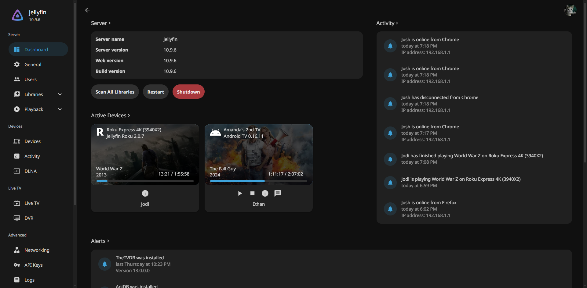

---

### **Custom CSS theme for Jellyfin (plus a backdrops supported version)**

---

### [Go to installation](#installation)

---

### **Scyfin Complete Theme**

`@import url('https://cdn.jsdelivr.net/gh/loof2736/scyfin@latest/CSS/scyfin-theme.css');`

### Options (Add these below the full theme)
- Disable static left drawer 
    - `@import url('https://cdn.jsdelivr.net/gh/loof2736/scyfin@latest/CSS/disable-static-drawer.css');`
- Themes:
    - Seafoam
        - `@import url('https://cdn.jsdelivr.net/gh/loof2736/scyfin@latest/CSS/theme-seafoam.css');`
        - 
    - Coral
        - `@import url('https://cdn.jsdelivr.net/gh/loof2736/scyfin@latest/CSS/theme-coral.css');`
        - 
    - Snow
        - `@import url('https://cdn.jsdelivr.net/gh/loof2736/scyfin@latest/CSS/theme-snow.css');`
        - 

---

### **Scyfin Complete Theme - Backdrops Supported**

**Note -** 
* Only install ONE version of the theme, do not install both the normal version and the backdrops supported version
* Backdrops need to be enabled in Jellyfin (Settings > Display > Backdrops) for backdrop supported version to display properly

`@import url('https://cdn.jsdelivr.net/gh/loof2736/scyfin@latest/CSS/scyfin-theme-backdrop.css');`

### Options (Add these below the full theme)
- Disable static left drawer (BACKDROP VERSION) 
    - `@import url('https://cdn.jsdelivr.net/gh/loof2736/scyfin@latest/CSS/disable-static-drawer-backdrop.css');`
- Themes:
    - Seafoam
        - `@import url('https://cdn.jsdelivr.net/gh/loof2736/scyfin@latest/CSS/theme-seafoam.css');`
        - 
    - Coral
        - `@import url('https://cdn.jsdelivr.net/gh/loof2736/scyfin@latest/CSS/theme-coral.css');`
        - 
    - Snow
        - `@import url('https://cdn.jsdelivr.net/gh/loof2736/scyfin@latest/CSS/theme-snow.css');`
        - 

---

### **Installation:**

---

**Server-wide install:**
* Click the hamburger icon (Top left)
* Navigate to "Dashboard" (If you don't see this, make sure you are signed in to your admin account)
* Navigate to "General"
* Near the bottom, under "Custom CSS code", paste the `@import url` for the theme you want
    * Note - 
        * Only install ONE version of the theme, do not install both the normal version and the backdrops supported version
    * Example:
    * 
* Optional - Paste the `@import url` for any options you want
    * Example:
    * 
* Click "Save"

---

**Single client install:**
* Click the hamburger icon (Top left)
* Navigate to "Settings"
* Navigate to "Display"
* Near the middle, under "Custom CSS code", paste the `@import url` for the theme you want
    * Note - 
        * Only install ONE version of the theme, do not install both the normal version and the backdrops supported version
        * If there is any server-wide custom CSS, you may want to enable "Disable server-provided custom CSS code", as the two themes WILL interfere with each other
    * Example:
    * 
* Optional - Paste the `@import url` for any options you want
    * Example:
    * 
* Click "Save"

---
