### **Modern CSS theme for Jellyfin with support for backdrops and custom accent colors**

[Go to installation](#installation)

---

### **Scyfin Base Theme**
Jellyfin 10.11.X and above
```
@import url('https://cdn.jsdelivr.net/gh/loof2736/scyfin@latest/CSS/scyfin-theme.css');
```

Jellyfin 10.10.X and lower
```
@import url('https://cdn.jsdelivr.net/gh/loof2736/scyfin@v1.4.17/CSS/scyfin-theme.css');
```


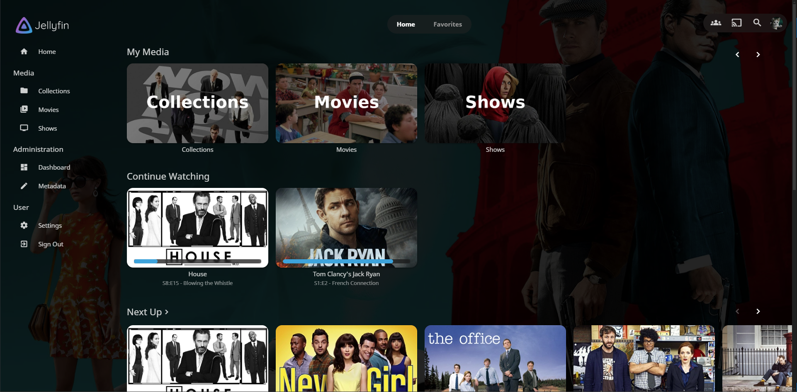
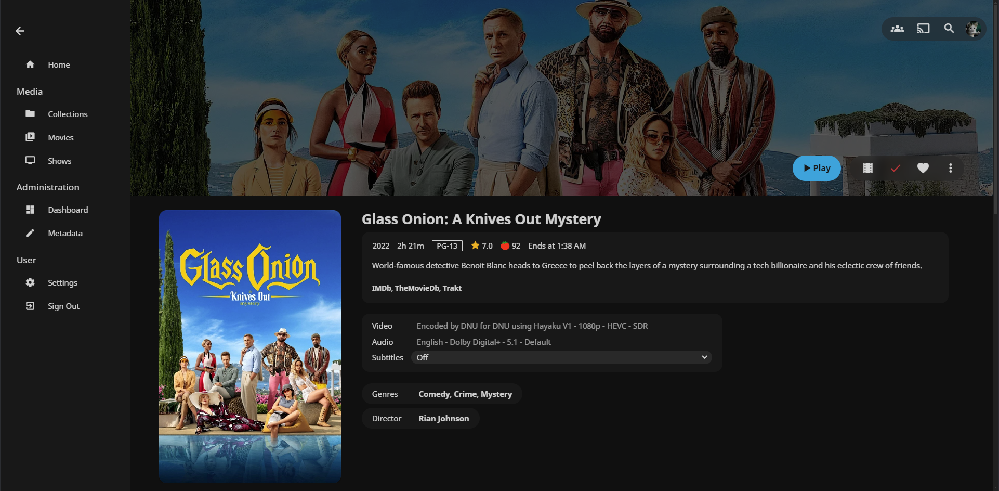
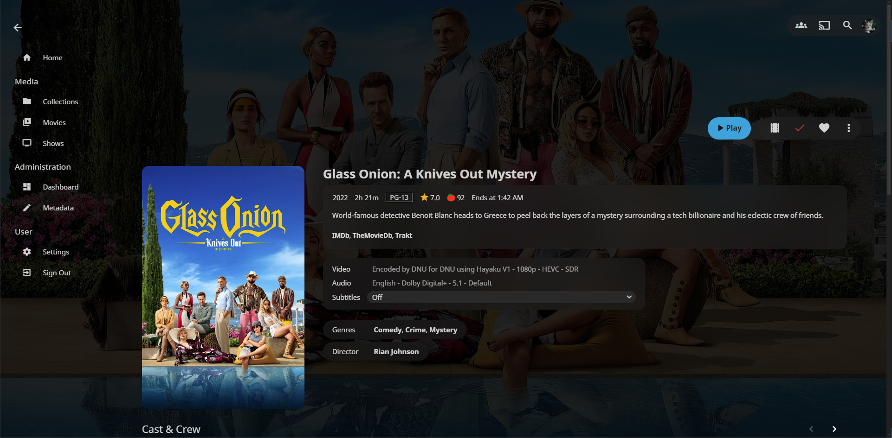
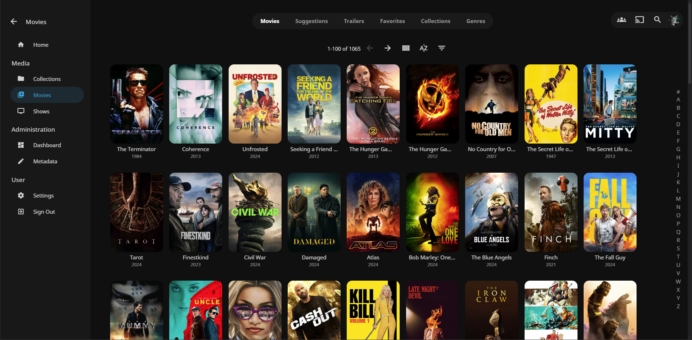
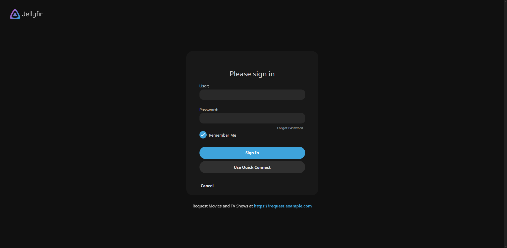

---

### **Options (Add these below the base theme)**
### Disable static left drawer 
```
@import url('https://cdn.jsdelivr.net/gh/loof2736/scyfin@latest/CSS/disable-static-drawer.css');
```

---

### **Themes:**
### Seafoam
```
@import url('https://cdn.jsdelivr.net/gh/loof2736/scyfin@latest/CSS/theme-seafoam.css');
```
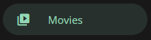

### Coral
```
@import url('https://cdn.jsdelivr.net/gh/loof2736/scyfin@latest/CSS/theme-coral.css');
```
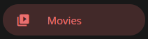

### Snow
```
@import url('https://cdn.jsdelivr.net/gh/loof2736/scyfin@latest/CSS/theme-snow.css');
```
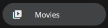

### OLED
```
@import url('https://cdn.jsdelivr.net/gh/loof2736/scyfin@latest/CSS/theme-oled.css');
```
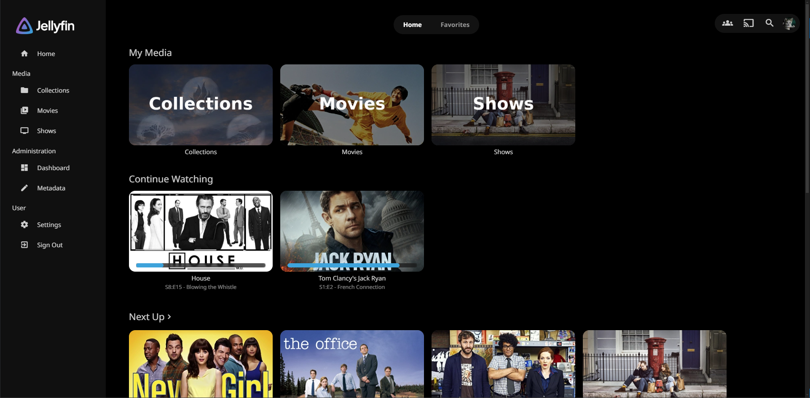
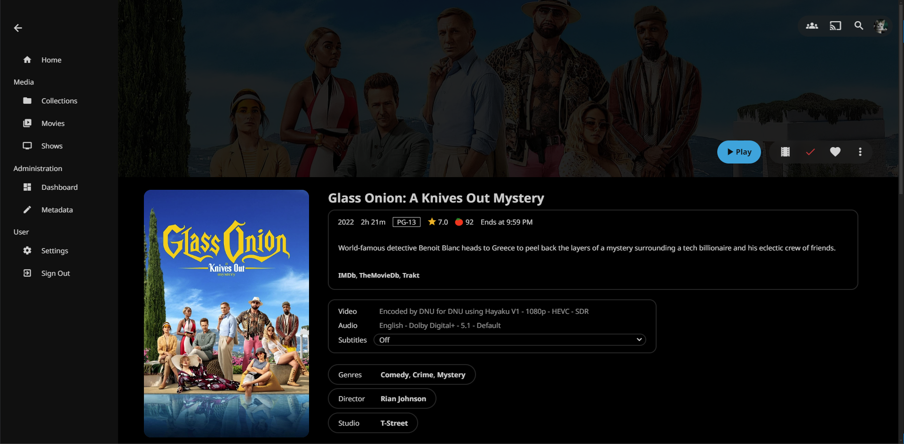

---

### **Installation:**

---

**Server-wide install:**
* Click the hamburger icon (Top left)
* Navigate to "Dashboard" (If you don't see this, make sure you are signed in to your admin account)
* Navigate to "Branding"
* Near the bottom, under "Custom CSS code", paste the `@import url` for the base Scyfin theme
    * Example:
    * 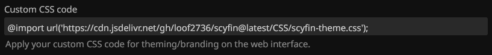
* Optional - Paste the `@import url` for any options / themes you may want
    * Example:
    * 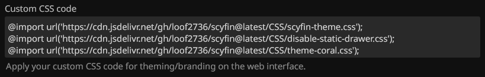
* Click "Save"

---

**Single client install:**
* Click the hamburger icon (Top left)
* Navigate to "Settings"
* Navigate to "Display"
* Near the middle, under "Custom CSS code", paste the `@import url` for the base Scyfin theme
    * Note - 
        * If there is any server-wide custom CSS, you may want to enable "Disable server-provided custom CSS code", as the two themes WILL interfere with each other
    * Example:
    * 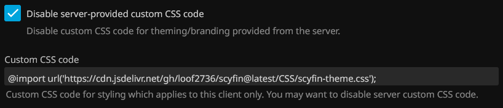
* Optional - Paste the `@import url` for any options / themes you may want
    * Example:
    * 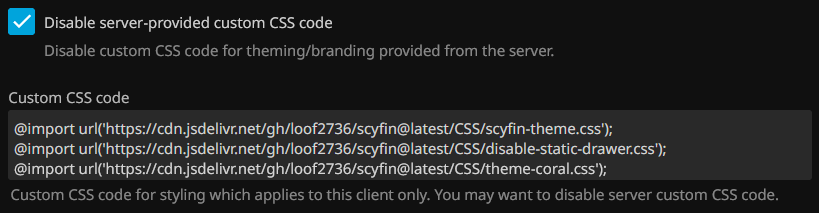
* Click "Save"
