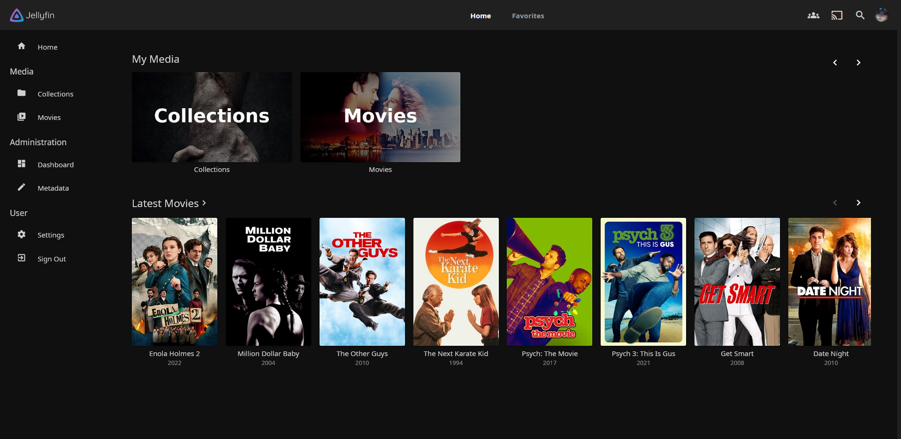
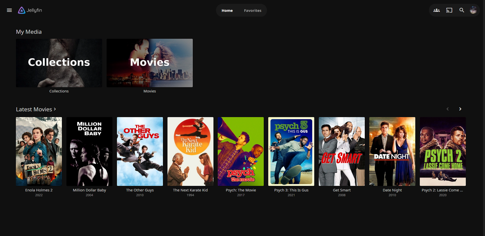

---

Custom CSS bits for the Jellyfin WebUI and a (VERY WIP) custom theme

---

Static Left Drawer

@import url('https://cdn.jsdelivr.net/gh/loof2736/scyfin@main/CSS/static-left-drawer.css');

---

Rounded Cards

@import url('https://cdn.jsdelivr.net/gh/loof2736/scyfin@main/CSS/rounded-cards.css');

---

Rounded Drawer Buttons

@import url('https://cdn.jsdelivr.net/gh/loof2736/scyfin@main/CSS/rounded-drawer-buttons.css');

---

Transparent Header

@import url('https://cdn.jsdelivr.net/gh/loof2736/scyfin@main/CSS/transparent-header.css');
